  

● SYS.ONLINE · OPEN TO WORK

  

<a href="https://github.com/NYN-05" style="font-family: ui-monospace, SFMono-Regular, Menlo, Consolas, monospace; font-size: 13px; letter-spacing: 1px; color: #0891B2; text-decoration: none; border: 1px solid rgba(127,127,127,0.35); border-radius: 8px; padding: 8px 18px; margin: 0 5px; display: inline-block;">[ github ]</a>
<a href="https://www.linkedin.com/in/jhashanknayan/" style="font-family: ui-monospace, SFMono-Regular, Menlo, Consolas, monospace; font-size: 13px; letter-spacing: 1px; color: #0891B2; text-decoration: none; border: 1px solid rgba(127,127,127,0.35); border-radius: 8px; padding: 8px 18px; margin: 0 5px; display: inline-block;">[ linkedin ]</a>
<a href="mailto:jnyn2005@gmail.com" style="font-family: ui-monospace, SFMono-Regular, Menlo, Consolas, monospace; font-size: 13px; letter-spacing: 1px; color: #0891B2; text-decoration: none; border: 1px solid rgba(127,127,127,0.35); border-radius: 8px; padding: 8px 18px; margin: 0 5px; display: inline-block;">[ email ]</a>
<a href="https://jhashanknayan.netlify.app" style="font-family: ui-monospace, SFMono-Regular, Menlo, Consolas, monospace; font-size: 13px; letter-spacing: 1px; color: #8B5CF6; text-decoration: none; border: 1px solid rgba(139,92,246,0.45); border-radius: 8px; padding: 8px 18px; margin: 0 5px; display: inline-block;">[ portfolio ]</a>

<h3 style="font-family: ui-monospace, SFMono-Regular, Menlo, Consolas, monospace; font-size: 14px; font-weight: 600; letter-spacing: 3px; text-transform: uppercase; color: #8B5CF6; margin: 44px 0 14px;">
  ▍&nbsp;01&nbsp;·&nbsp;FOCUS AREAS
</h3>

<table width="100%" cellspacing="12" style="border-collapse: separate;">
  <tr>
    <td width="66%" valign="top" style="border: 1px solid rgba(127,127,127,0.28); border-radius: 14px; padding: 22px 24px; background: linear-gradient(180deg, rgba(8,145,178,0.06), rgba(127,127,127,0.03));">
      
01 ▸ CORE

      
Backend Systems

      
APIs, event pipelines and data services engineered to stay up under load — designed for observability from the first commit.

      
PYTHON · GO · NODE · FASTAPI · DJANGO

    </td>
    <td width="34%" valign="top" style="border: 1px solid rgba(127,127,127,0.28); border-radius: 14px; padding: 22px 24px; background: linear-gradient(180deg, rgba(139,92,246,0.06), rgba(127,127,127,0.03));">
      
02 ▸ INTELLIGENCE

      
ML &amp; Data Systems

      
Models built to earn trust in production — classification, grounding, forensics and evidence-first pipelines.

      
PYTORCH · TF · OPENCV · NLP

    </td>
  </tr>
  <tr>
    <td width="34%" valign="top" style="border: 1px solid rgba(127,127,127,0.28); border-radius: 14px; padding: 22px 24px; background: linear-gradient(180deg, rgba(127,127,127,0.05), rgba(127,127,127,0.02));">
      
03 ▸ SCALE

      
Distributed Systems

      
Coordinating work across machines — queues, caching and failure-tolerant orchestration that treats downtime as a design input.

      
REDIS · DOCKER · K8S

    </td>
    <td width="33%" valign="top" style="border: 1px solid rgba(127,127,127,0.28); border-radius: 14px; padding: 22px 24px; background: linear-gradient(180deg, rgba(127,127,127,0.05), rgba(127,127,127,0.02));">
      
04 ▸ SPEED

      
Performance

      
Latency budgets, profiling and the last 10% that separates a prototype from a product.

      
PROFILING · CACHING · SQL

    </td>
    <td width="33%" valign="top" style="border: 1px solid rgba(127,127,127,0.28); border-radius: 14px; padding: 22px 24px; background: linear-gradient(180deg, rgba(127,127,127,0.05), rgba(127,127,127,0.02));">
      
05 ▸ DELIVERY

      
Cloud &amp; DevOps

      
Shipping it: containers, orchestration, CI and the cloud plumbing between code and customers.

      
AWS · DOCKER · K8S · LINUX

    </td>
  </tr>
</table>

<h3 style="font-family: ui-monospace, SFMono-Regular, Menlo, Consolas, monospace; font-size: 14px; font-weight: 600; letter-spacing: 3px; text-transform: uppercase; color: #8B5CF6; margin: 44px 0 14px;">
  ▍&nbsp;02&nbsp;·&nbsp;CAPABILITIES
</h3>

<table width="100%" cellspacing="12" style="border-collapse: separate;">
  <tr>
    <td width="66%" valign="top">
      
    </td>
    <td width="34%" valign="top" style="border: 1px solid rgba(127,127,127,0.28); border-radius: 14px; padding: 24px 24px; background: linear-gradient(180deg, rgba(8,145,178,0.05), rgba(127,127,127,0.02));">
      
OPERATING PRINCIPLES

      

        ▸ design for failure, ship for recovery 
        ▸ measure before you optimize 
        ▸ models earn trust with evidence 
        ▸ small deploys, fast feedback 
        ▸ boring tech, sharp systems
      

      
// base: india · utc +05:30 · full-stack range

    </td>
  </tr>
</table>

<h3 style="font-family: ui-monospace, SFMono-Regular, Menlo, Consolas, monospace; font-size: 14px; font-weight: 600; letter-spacing: 3px; text-transform: uppercase; color: #8B5CF6; margin: 44px 0 14px;">
  ▍&nbsp;03&nbsp;·&nbsp;TELEMETRY
</h3>

<table width="100%" cellspacing="10" style="border-collapse: separate;">
  <tr>
    <td width="66%" valign="top">
      
    </td>
    <td width="34%" valign="top">
      
    </td>
  </tr>
  <tr>
    <td width="34%" valign="top">
      
    </td>
    <td width="66%" valign="top">
      
    </td>
  </tr>
</table>

<h3 style="font-family: ui-monospace, SFMono-Regular, Menlo, Consolas, monospace; font-size: 14px; font-weight: 600; letter-spacing: 3px; text-transform: uppercase; color: #8B5CF6; margin: 44px 0 14px;">
  ▍&nbsp;04&nbsp;·&nbsp;FIELD REPORTS
</h3>

<table width="100%" cellspacing="10" style="border-collapse: separate;">
  <tr>
    <td width="33%" valign="top" style="border: 1px solid rgba(127,127,127,0.28); border-radius: 14px; padding: 20px 22px; background: linear-gradient(180deg, rgba(139,92,246,0.05), rgba(127,127,127,0.03));">
      PRJ-01
      DEPLOYED
      

        <a href="https://github.com/NYN-05/SceneTrace_AI" title="Open SceneTrace_AI" style="color: #0891B2; text-decoration: none;">SceneTrace_AI</a>
      

      
Natural-language video grounding: upload footage, describe a moment, retrieve the matching clip via CLIP + FAISS semantic search.

      
FASTAPI · REACT · CLIP · FAISS · CV

      

        
SPEC ▾

        
STACK: FastAPI · React · CLIP · FAISS · ffmpeg HIGHLIGHT: semantic video search in milliseconds

      

    </td>
    <td width="33%" valign="top" style="border: 1px solid rgba(127,127,127,0.28); border-radius: 14px; padding: 20px 22px; background: linear-gradient(180deg, rgba(139,92,246,0.05), rgba(127,127,127,0.03));">
      PRJ-02
      RESEARCH
      

        <a href="https://github.com/NYN-05/VERISIGHT_V1" title="Open VERISIGHT_V1" style="color: #0891B2; text-decoration: none;">VERISIGHT_V1</a>
      

      
Multi-layer image forensics: CNN + Vision Transformer + GAN analysis + OCR to detect forged and manipulated documents.

      
CNN · VIT · GAN · OCR

      

        
SPEC ▾

        
STACK: PyTorch · CNN · ViT · GAN · OCR HIGHLIGHT: multi-signal forgery verdict

      

    </td>
    <td width="33%" valign="top" style="border: 1px solid rgba(127,127,127,0.28); border-radius: 14px; padding: 20px 22px; background: linear-gradient(180deg, rgba(139,92,246,0.05), rgba(127,127,127,0.03));">
      PRJ-03
      RESEARCH
      

        <a href="https://github.com/NYN-05/Report_Generation" title="Open Report_Generation" style="color: #0891B2; text-decoration: none;">Report_Generation</a>
      

      
Evidence-first, multi-agent report generation with fact extraction, knowledge graphs, RAG and hallucination detection.

      
LLM · RAG · KG · AGENTS

      

        
SPEC ▾

        
STACK: LLM agents · knowledge graphs · RAG HIGHLIGHT: hallucination-gated output

      

    </td>
  </tr>
  <tr>
    <td width="33%" valign="top" style="border: 1px solid rgba(127,127,127,0.28); border-radius: 14px; padding: 20px 22px; background: linear-gradient(180deg, rgba(8,145,178,0.05), rgba(127,127,127,0.03));">
      PRJ-04
      DEPLOYED
      

        <a href="https://github.com/NYN-05/NewsPulse" title="Open NewsPulse" style="color: #0891B2; text-decoration: none;">NewsPulse</a>
      

      
GPU-accelerated news aggregation across 100+ RSS feeds with NLP sentiment analysis and story clustering.

      
NLP · RSS · GPU · ML

      

        
SPEC ▾

        
STACK: Python · GPU · NLP · clustering HIGHLIGHT: 100+ feeds clustered in near real time

      

    </td>
    <td width="33%" valign="top" style="border: 1px solid rgba(127,127,127,0.28); border-radius: 14px; padding: 20px 22px; background: linear-gradient(180deg, rgba(8,145,178,0.05), rgba(127,127,127,0.03));">
      PRJ-05
      PRODUCTION
      

        <a href="https://github.com/NYN-05/MiniProject" title="Open MiniProject" style="color: #0891B2; text-decoration: none;">MiniProject</a>
      

      
Email scam detector: linguistically-informed feature engineering with a PyTorch classifier on an Enron-derived corpus.

      
PYTORCH · NLP · FEATURES

      

        
SPEC ▾

        
STACK: PyTorch · scikit-learn · NLP HIGHLIGHT: domain + metadata + entropy features

      

    </td>
    <td width="33%" valign="top" style="border: 1px solid rgba(127,127,127,0.28); border-radius: 14px; padding: 20px 22px; background: linear-gradient(180deg, rgba(8,145,178,0.05), rgba(127,127,127,0.03));">
      PRJ-06
      DEPLOYED
      

        <a href="https://github.com/NYN-05/TheCakeTime_Website" title="Open TheCakeTime_Website" style="color: #0891B2; text-decoration: none;">TheCakeTime_Website</a>
      

      
Full bakery e-commerce: Next.js 14 + TypeScript, Express, MongoDB and Stripe with a secure cart and payment flow.

      
NEXT.JS · TS · MONGO · STRIPE

      

        
SPEC ▾

        
STACK: Next.js 14 · Express · MongoDB · Stripe HIGHLIGHT: full checkout pipeline

      

    </td>
  </tr>
</table>

<h3 style="font-family: ui-monospace, SFMono-Regular, Menlo, Consolas, monospace; font-size: 14px; font-weight: 600; letter-spacing: 3px; text-transform: uppercase; color: #8B5CF6; margin: 44px 0 14px;">
  ▍&nbsp;05&nbsp;·&nbsp;COMMS
</h3>

<a href="https://github.com/NYN-05" style="font-family: ui-monospace, SFMono-Regular, Menlo, Consolas, monospace; font-size: 13px; letter-spacing: 1px; color: #0891B2; text-decoration: none; border: 1px solid rgba(127,127,127,0.35); border-radius: 8px; padding: 8px 18px; margin: 0 5px; display: inline-block;">github.com/NYN-05</a>
<a href="https://www.linkedin.com/in/jhashanknayan/" style="font-family: ui-monospace, SFMono-Regular, Menlo, Consolas, monospace; font-size: 13px; letter-spacing: 1px; color: #0891B2; text-decoration: none; border: 1px solid rgba(127,127,127,0.35); border-radius: 8px; padding: 8px 18px; margin: 0 5px; display: inline-block;">linkedin.com/in/jhashanknayan</a>
<a href="mailto:jnyn2005@gmail.com" style="font-family: ui-monospace, SFMono-Regular, Menlo, Consolas, monospace; font-size: 13px; letter-spacing: 1px; color: #0891B2; text-decoration: none; border: 1px solid rgba(127,127,127,0.35); border-radius: 8px; padding: 8px 18px; margin: 0 5px; display: inline-block;">jnyn2005@gmail.com</a>
<a href="https://jhashanknayan.netlify.app" style="font-family: ui-monospace, SFMono-Regular, Menlo, Consolas, monospace; font-size: 13px; letter-spacing: 1px; color: #8B5CF6; text-decoration: none; border: 1px solid rgba(139,92,246,0.45); border-radius: 8px; padding: 8px 18px; margin: 0 5px; display: inline-block;">portfolio ↗</a>

— END OF TRANSMISSION —

© 2026 Jhashank Nayan · engineered in the command center · profile.ops ▸ 

