  

● OPEN TO WORK &nbsp;·&nbsp;
<a href="https://github.com/NYN-05" style="color: #7FA020; text-decoration: none;">github</a> &nbsp;·&nbsp;
<a href="https://www.linkedin.com/in/jhashanknayan/" style="color: #7FA020; text-decoration: none;">linkedin</a> &nbsp;·&nbsp;
<a href="mailto:jnyn2005@gmail.com" style="color: #7FA020; text-decoration: none;">email</a> &nbsp;·&nbsp;
<a href="https://jhashanknayan.netlify.app" style="color: #7FA020; text-decoration: none;">portfolio</a>

  

<h3 style="font-family: ui-monospace, SFMono-Regular, Menlo, Consolas, monospace; font-size: 14px; font-weight: 600; letter-spacing: 3px; text-transform: uppercase; color: #7FA020; margin: 44px 0 14px;">
  ▍&nbsp;01&nbsp;·&nbsp;FOCUS
</h3>

<table width="100%" cellspacing="12" style="border-collapse: separate;">
  <tr>
    <td width="66%" valign="top" style="border: 1px solid rgba(127,127,127,0.28); border-radius: 14px; padding: 20px 22px; background: radial-gradient(120% 100% at 0% 0%, rgba(216,255,94,0.10), transparent 55%), linear-gradient(180deg, rgba(127,127,127,0.04), rgba(127,127,127,0.02));">
      
01 ▸ CORE

      
Backend Systems

      
APIs, pipelines and data services built to stay up under load.

    </td>
    <td width="34%" valign="top" style="border: 1px solid rgba(127,127,127,0.28); border-radius: 14px; padding: 20px 22px; background: radial-gradient(120% 100% at 100% 0%, rgba(148,163,184,0.14), transparent 55%), linear-gradient(180deg, rgba(127,127,127,0.04), rgba(127,127,127,0.02));">
      
02 ▸ INTELLIGENCE

      
ML &amp; Data Systems

      
Models built to earn trust — classification, grounding, forensics.

    </td>
  </tr>
  <tr>
    <td width="34%" valign="top" style="border: 1px solid rgba(127,127,127,0.28); border-radius: 14px; padding: 20px 22px; background: radial-gradient(120% 100% at 0% 100%, rgba(148,163,184,0.14), transparent 55%), linear-gradient(180deg, rgba(127,127,127,0.04), rgba(127,127,127,0.02));">
      
03 ▸ SCALE

      
Distributed Systems

      
Queues, caching and failure-tolerant orchestration at scale.

    </td>
    <td width="66%" valign="top" style="border: 1px solid rgba(127,127,127,0.28); border-radius: 14px; padding: 20px 22px; background: radial-gradient(120% 100% at 100% 100%, rgba(216,255,94,0.10), transparent 55%), linear-gradient(180deg, rgba(127,127,127,0.04), rgba(127,127,127,0.02));">
      
04 ▸ SPEED

      
Performance

      
Latency budgets and profiling — the last 10% from prototype to product.

    </td>
  </tr>
</table>

<h3 style="font-family: ui-monospace, SFMono-Regular, Menlo, Consolas, monospace; font-size: 14px; font-weight: 600; letter-spacing: 3px; text-transform: uppercase; color: #7FA020; margin: 44px 0 14px;">
  ▍&nbsp;02&nbsp;·&nbsp;CAPABILITIES
</h3>

  

<h3 style="font-family: ui-monospace, SFMono-Regular, Menlo, Consolas, monospace; font-size: 14px; font-weight: 600; letter-spacing: 3px; text-transform: uppercase; color: #7FA020; margin: 44px 0 14px;">
  ▍&nbsp;03&nbsp;·&nbsp;SIGNAL
</h3>

<table width="100%" cellspacing="10" style="border-collapse: separate;">
  <tr>
    <td width="66%" valign="top">
      
    </td>
    <td width="34%" valign="top">
      
    </td>
  </tr>
</table>

<h3 style="font-family: ui-monospace, SFMono-Regular, Menlo, Consolas, monospace; font-size: 14px; font-weight: 600; letter-spacing: 3px; text-transform: uppercase; color: #7FA020; margin: 44px 0 14px;">
  ▍&nbsp;04&nbsp;·&nbsp;REPOS
</h3>

<table width="100%" cellspacing="10" style="border-collapse: separate;">
  <tr>
    <td width="33%" valign="top" style="border: 1px solid rgba(127,127,127,0.28); border-radius: 14px; padding: 20px 22px; background: radial-gradient(120% 100% at 0% 0%, rgba(216,255,94,0.08), transparent 55%), linear-gradient(180deg, rgba(127,127,127,0.04), rgba(127,127,127,0.02));">
      

        <a href="https://github.com/NYN-05/SceneTrace_AI" title="Open SceneTrace_AI" style="color: #7FA020; text-decoration: none;">SceneTrace_AI</a>
      

      
Natural-language video grounding — retrieve matching clips via CLIP + FAISS.

      
FASTAPI · REACT · CLIP · FAISS

    </td>
    <td width="33%" valign="top" style="border: 1px solid rgba(127,127,127,0.28); border-radius: 14px; padding: 20px 22px; background: radial-gradient(120% 100% at 50% 0%, rgba(148,163,184,0.12), transparent 60%), linear-gradient(180deg, rgba(127,127,127,0.04), rgba(127,127,127,0.02));">
      

        <a href="https://github.com/NYN-05/VERISIGHT_V1" title="Open VERISIGHT_V1" style="color: #7FA020; text-decoration: none;">VERISIGHT_V1</a>
      

      
Multi-layer image forensics — CNN + ViT + GAN analysis for forged documents.

      
PYTORCH · CNN · VIT · GAN · OCR

    </td>
    <td width="33%" valign="top" style="border: 1px solid rgba(127,127,127,0.28); border-radius: 14px; padding: 20px 22px; background: radial-gradient(120% 100% at 100% 0%, rgba(216,255,94,0.08), transparent 55%), linear-gradient(180deg, rgba(127,127,127,0.04), rgba(127,127,127,0.02));">
      

        <a href="https://github.com/NYN-05/Report_Generation" title="Open Report_Generation" style="color: #7FA020; text-decoration: none;">Report_Generation</a>
      

      
Evidence-first multi-agent reports — knowledge graphs, RAG, hallucination gates.

      
LLM · RAG · KG · AGENTS

    </td>
  </tr>
</table>

— END OF TRANSMISSION — 

© 2026 Jhashank Nayan · profile.ops ▸ 

